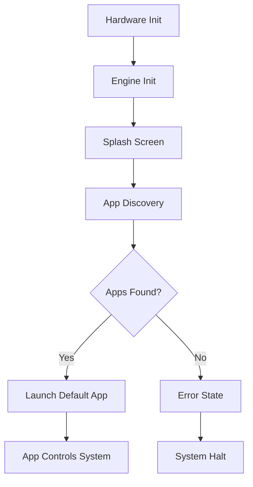
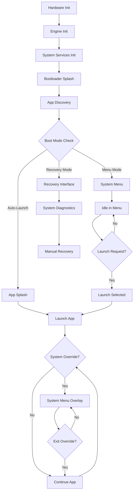

# Wisp Engine Enhanced Bootloader Architecture

## 🎯 **Vision**

The Wisp Engine bootloader should operate as a **persistent system-level interface** that can:

1. **Idle gracefully** without requiring an app/ROM to be loaded
2. **Provide consistent system access** to settings and configuration panels
3. **Supersede app state** when system-level input combinations are detected
4. **Serve as a universal launcher** for ROMs and applications
5. **Maintain system integrity** with proper resource management

## 🏗️ **Enhanced Boot Sequence**

### **Traditional Boot Flow (Current)**


### **Enhanced Boot Flow (Proposed)**


## 🎛️ **System-Level Input Handling**

### **Global System Combinations**
```cpp
// These combinations work ANYWHERE in the system
struct SystemInputCombinations {
    // Primary system access (always available)
    bool systemMenu = (SELECT + START + 2sec);      // Enter system menu
    bool forceReset = (A + B + SELECT + START + 5sec); // Emergency reset
    
    // Quick access shortcuts
    bool quickSettings = (SELECT + UP + 1sec);      // Quick settings overlay
    bool taskSwitcher = (SELECT + DOWN + 1sec);     // App switcher overlay  
    bool volumeControl = (SELECT + LEFT/RIGHT);     // Volume adjustment
    bool brightnessControl = (START + LEFT/RIGHT);  // Brightness adjustment
    
    // Development/Debug
    bool debugConsole = (START + SELECT + A + 3sec); // Debug console
    bool performanceStats = (START + SELECT + B);    // Performance overlay
};
```

### **Input Priority System**
```cpp
enum InputPriority {
    PRIORITY_EMERGENCY = 0,     // Emergency reset, recovery mode
    PRIORITY_SYSTEM = 1,        // System menu, quick settings
    PRIORITY_APP_OVERRIDE = 2,  // App-level system integration
    PRIORITY_APP_NORMAL = 3     // Normal app input
};
```

## 🖥️ **Persistent System Interface**

### **System Menu Structure**
```
WISP SYSTEM MENU
├── 📱 Applications
│   ├── Recently Used (last 5)
│   ├── Browse All Apps
│   ├── App Manager
│   └── Install from SD/Network
├── ⚙️ Settings
│   ├── 🖼️ Display Settings
│   ├── 🔊 Audio Settings  
│   ├── 🌐 Network Settings
│   ├── 🔧 System Settings
│   └── 🎨 Theme Settings
├── 📊 System Info
│   ├── Hardware Status
│   ├── Performance Monitor
│   ├── Storage Usage
│   └── Network Status
├── 🔧 Tools
│   ├── File Manager
│   ├── Task Manager
│   ├── Backup/Restore
│   └── Developer Tools
└── 🔄 Power
    ├── Restart System
    ├── Sleep Mode
    └── Shutdown
```

### **System Overlay Modes**
```cpp
enum SystemOverlayMode {
    OVERLAY_NONE = 0,           // No overlay active
    OVERLAY_QUICK_SETTINGS,     // Quick settings strip
    OVERLAY_VOLUME_CONTROL,     // Volume adjustment
    OVERLAY_BRIGHTNESS_CONTROL, // Brightness adjustment
    OVERLAY_TASK_SWITCHER,      // App switcher
    OVERLAY_NOTIFICATION_BAR,   // System notifications
    OVERLAY_PERFORMANCE_STATS,  // Debug performance info
    OVERLAY_FULL_MENU          // Full system menu
};
```

## 🔧 **Enhanced Bootloader Class**

### **Core Bootloader Architecture**
```cpp
class WispSystemBootloader {
private:
    // Enhanced boot stages
    enum BootStage {
        BOOT_HARDWARE_INIT,
        BOOT_ENGINE_INIT, 
        BOOT_SYSTEM_SERVICES,    // New: Initialize system services
        BOOT_RECOVERY_CHECK,     // New: Check for recovery mode
        BOOT_SPLASH_DISPLAY,
        BOOT_APP_DISCOVERY,
        BOOT_MODE_DECISION,      // New: Decide boot mode
        BOOT_MENU_IDLE,          // New: Idle in system menu
        BOOT_APP_PREPARE,
        BOOT_APP_LAUNCH,
        BOOT_APP_RUNNING,        // New: App running with system monitoring
        BOOT_SYSTEM_OVERLAY      // New: System overlay active
    };
    
    // System state management
    struct SystemState {
        bool appRunning = false;
        bool systemOverlayActive = false;
        bool emergencyMode = false;
        bool recoveryMode = false;
        SystemOverlayMode overlayMode = OVERLAY_NONE;
        AppInfo* currentApp = nullptr;
        uint32_t systemIdleTime = 0;
        uint32_t lastUserInput = 0;
    } systemState;
    
    // System services
    SystemMenuManager* menuManager;
    SystemOverlayManager* overlayManager;
    SystemInputHandler* inputHandler;
    SystemResourceMonitor* resourceMonitor;
    SystemNotificationManager* notifications;
    
public:
    // Enhanced bootloader interface
    bool canIdleWithoutApp() const { return true; }
    void enterSystemMenu();
    void exitSystemMenu(); 
    void showSystemOverlay(SystemOverlayMode mode);
    void hideSystemOverlay();
    
    // App lifecycle management
    bool launchApp(const AppInfo& app);
    bool terminateApp();
    bool suspendApp();
    bool resumeApp();
    
    // System override handling  
    void handleSystemInput(const WispInputState& input);
    bool checkSystemOverride(const WispInputState& input);
};
```

### **System Menu Manager**
```cpp
class SystemMenuManager {
private:
    enum MenuCategory {
        MENU_APPLICATIONS,
        MENU_SETTINGS,
        MENU_SYSTEM_INFO,
        MENU_TOOLS,
        MENU_POWER
    };
    
    struct MenuState {
        MenuCategory currentCategory = MENU_APPLICATIONS;
        int categorySelection = 0;
        int itemSelection = 0;
        bool inSubMenu = false;
        MenuPanel* activePanel = nullptr;
    } menuState;
    
    // Menu panels (persistent)
    ApplicationsPanel* appsPanel;
    DisplaySettingsPanel* displayPanel;
    AudioSettingsPanel* audioPanel;
    NetworkSettingsPanel* networkPanel;  
    SystemSettingsPanel* systemPanel;
    SystemInfoPanel* infoPanel;
    
public:
    void initialize();
    void update(const WispInputState& input);
    void render();
    void activate();
    void deactivate();
    
    // Navigation
    void navigateToCategory(MenuCategory category);
    void navigateToPanel(const std::string& panelName);
    bool canExitMenu() const;
};
```

## 🎮 **Input System Integration**

### **Global Input Handler**
```cpp
class SystemInputHandler {
private:
    struct InputState {
        WispInputState current;
        WispInputState previous;
        uint32_t combinationStartTime[8]; // Track combination timing
        bool combinationActive[8];
        InputPriority currentPriority = PRIORITY_APP_NORMAL;
    } inputState;
    
    // System combinations
    std::vector<SystemInputCombination> systemCombinations;
    
public:
    // Input processing pipeline
    ProcessResult processInput(const WispInputState& rawInput);
    bool checkSystemCombinations(const WispInputState& input);
    void registerSystemCombination(const SystemInputCombination& combo);
    
    // Priority management
    void setInputPriority(InputPriority priority);
    InputPriority getCurrentPriority() const;
    bool canAppReceiveInput() const;
};

struct ProcessResult {
    bool systemHandled = false;
    bool appCanReceive = true;
    SystemOverlayMode triggeredOverlay = OVERLAY_NONE;
    WispInputState filteredInput;
};
```

### **System Override Patterns**
```cpp
class SystemOverrideManager {
public:
    // App state preservation
    struct AppSnapshot {
        AppInfo appInfo;
        void* appStatePtr;
        size_t appStateSize;
        uint32_t snapshotTime;
        bool appWasPaused;
    };
    
    // Override lifecycle
    bool beginSystemOverride(SystemOverlayMode mode);
    void endSystemOverride();
    bool saveAppState(AppSnapshot& snapshot);
    bool restoreAppState(const AppSnapshot& snapshot);
    
    // Resource management during override
    void pauseAppResources();
    void resumeAppResources();
    void freeSystemResources();
};
```

## 📱 **Application Integration**

### **App Lifecycle Events**
```cpp
// Enhanced app interface for system integration
class WispSystemApp : public WispApp {
public:
    // System integration hooks
    virtual void onSystemOverrideBegin(SystemOverlayMode mode) {}
    virtual void onSystemOverrideEnd() {}
    virtual bool canBePaused() const { return true; }
    virtual bool canBeTerminated() const { return true; }
    virtual void onLowMemoryWarning() {}
    virtual void onBatteryLow() {}
    
    // App state management
    virtual bool saveState(void* buffer, size_t bufferSize) { return false; }
    virtual bool loadState(const void* buffer, size_t bufferSize) { return false; }
    virtual size_t getStateSize() const { return 0; }
};
```

### **System Service Access**
```cpp
// Apps can request system services through controlled API
class WispSystemServices {
public:
    // Notification system
    bool postNotification(const std::string& message, NotificationType type);
    
    // Resource monitoring
    SystemResourceInfo getResourceInfo();
    bool requestMemory(size_t bytes);
    
    // Settings access (read-only for apps)
    DisplaySettings getDisplaySettings();
    AudioSettings getAudioSettings();
    
    // File system access (sandboxed)
    FileSystemAccess getAppFileSystem();
};
```

## 🔄 **Resource Management**

### **System Resource Monitor**
```cpp
class SystemResourceMonitor {
private:
    struct ResourceState {
        // Memory tracking
        size_t totalRAM;
        size_t freeRAM;
        size_t appRAM;
        size_t systemRAM;
        
        // Storage tracking
        size_t totalStorage;
        size_t freeStorage;
        size_t systemStorage;
        size_t appStorage;
        
        // Performance tracking
        float cpuUsage;
        float temperatureCelsius;
        float batteryVoltage;
        
        // System health
        uint32_t uptimeSeconds;
        uint32_t bootCount;
        uint32_t crashCount;
    } resourceState;
    
public:
    void updateResourceState();
    ResourceState getResourceState() const;
    bool isLowMemory() const;
    bool isLowStorage() const;
    bool isOverheating() const;
    bool isBatteryLow() const;
    
    // Resource allocation
    bool canAllocateMemory(size_t bytes);
    bool canCreateFile(size_t bytes);
    void enforceResourceLimits();
};
```

## 🚀 **Implementation Benefits**

### ✅ **System Reliability**
- **Graceful degradation**: System remains functional without apps
- **Emergency access**: Always accessible recovery and settings
- **Resource protection**: System reserves resources for core functions
- **State preservation**: Apps can be suspended/resumed cleanly

### ✅ **User Experience**
- **Consistent interface**: System functions work identically everywhere
- **Quick access**: Common settings accessible via shortcuts
- **App management**: Easy switching and management of applications
- **Visual feedback**: Clear indication of system vs app state

### ✅ **Developer Experience**
- **Clean separation**: Clear boundaries between system and app code
- **Predictable lifecycle**: Well-defined app states and transitions
- **System services**: Controlled access to system functionality
- **Debug support**: Built-in debugging and monitoring tools

### ✅ **Scalability**
- **Plugin architecture**: Easy to add new system panels
- **Themable interface**: Consistent visual design system
- **Multi-platform**: Works across ESP32-C6/S3 variants
- **Future-proof**: Architecture supports advanced features

## 🛠️ **Implementation Strategy**

### **Phase 1: Core Bootloader Enhancement**
1. Enhance existing `WispBootloader` class with idle mode
2. Implement system input combination detection
3. Create basic system menu structure
4. Add app lifecycle management

### **Phase 2: System Services Integration**  
1. Implement `SystemMenuManager` 
2. Create persistent settings panels
3. Add system overlay functionality
4. Integrate with existing settings system

### **Phase 3: App Integration**
1. Enhance app interface with system hooks
2. Implement app state preservation
3. Add system service access layer
4. Create app management tools

### **Phase 4: Advanced Features**
1. Add system notifications
2. Implement task switching
3. Create developer tools
4. Add theming system

This architecture transforms the bootloader from a simple app launcher into a comprehensive **system-level interface** that provides consistent, reliable access to device functionality while maintaining clean separation between system and application concerns.
