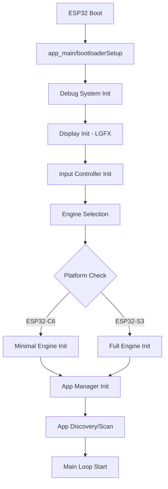
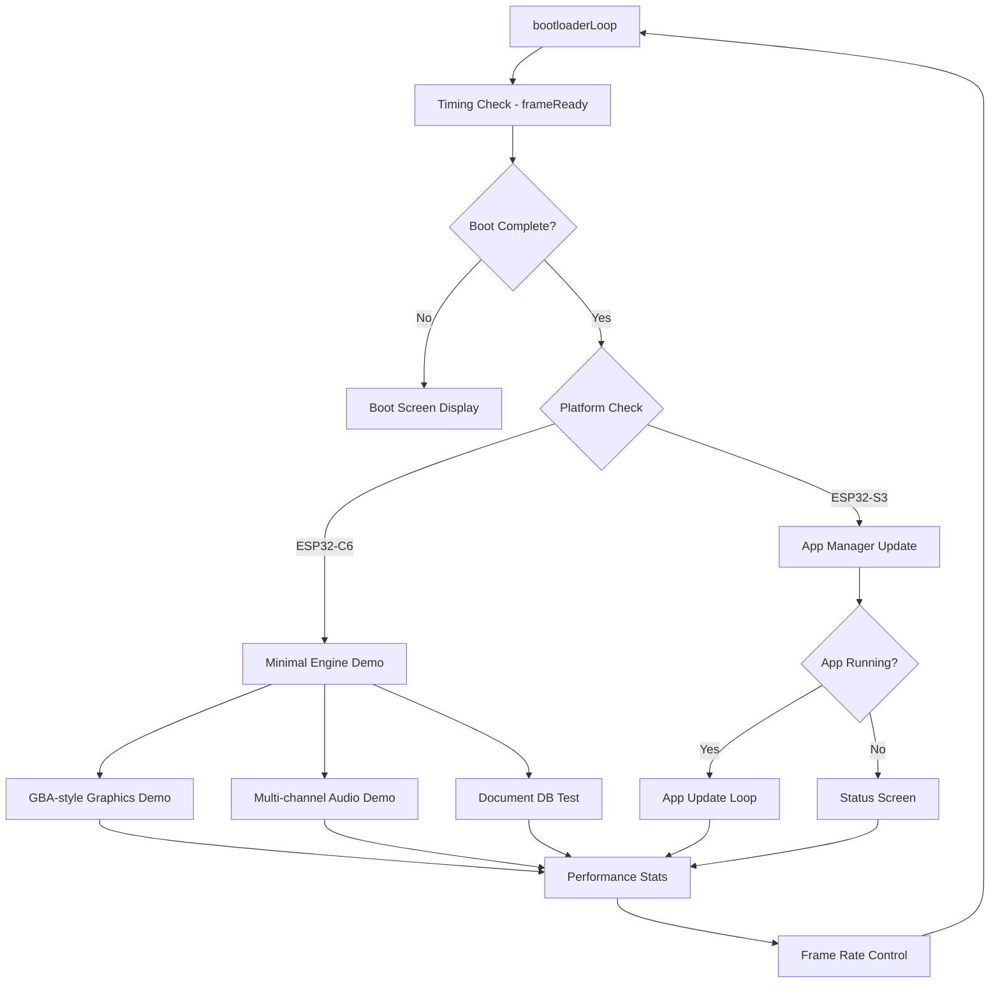
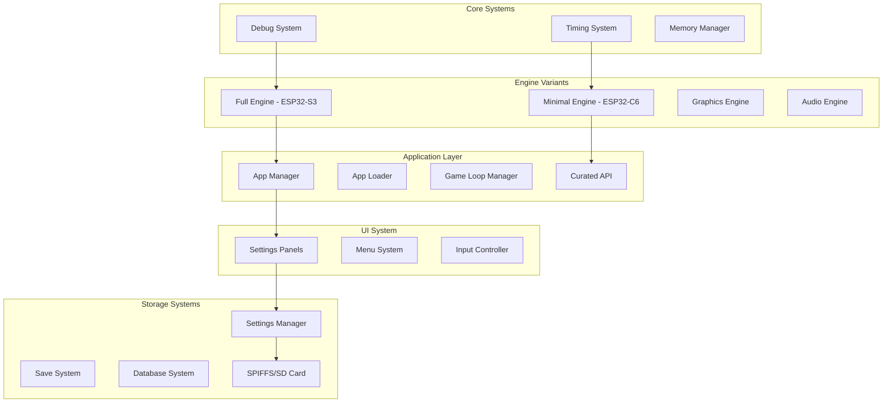

# Wisp Engine - Architecture Analysis & Flow Documentation

## 📋 **Executive Summary**

The Wisp Engine is a **dual-platform ESP32-C6/S3 game engine** with significant architectural complexity, multiple engine variants, extensive duplication, and fragmented code across different systems. This analysis identifies critical areas for refactoring and modularization.

---

## 🏗️ **Application Flow Overview**

### **Boot Sequence**


### **Main Loop Flow**


### **Component Architecture**


---

## 🔍 **Critical Issues Identified**

### **1. Massive Code Duplication**

#### **Settings Panels - Duplicated Across Multiple Locations**
- **Primary Location**: `src/system/ui/panels/`
  - `audio_settings.h` (fully integrated with SettingsManager)
  - `display_settings.h` (fully integrated with SettingsManager) 
  - `system_settings.h` (fully integrated with SettingsManager)
  - `network_settings.h`

- **Duplicate Location**: `src/utils/panels/`
  - `audio_settings.h` - **OUTDATED DUPLICATE**
  - `display_settings.h` - **OUTDATED DUPLICATE**
  - `network_settings.h` - **OUTDATED DUPLICATE**
  - `system_settings.h` - **OUTDATED DUPLICATE**

**❌ Action Required**: Delete entire `src/utils/panels/` directory

#### **Multiple Engine Implementations**
- **Graphics Engine**: 3+ separate implementations
  - `src/engine/graphics/engine.h` - Primary graphics engine
  - `src/engine/graphics/optimized_engine.h` - Optimized variant
  - `src/engine/minimal/minimal_engine.h` - ESP32-C6 minimal engine

- **Audio Engine**: Multiple variants
  - `src/engine/audio/audio_engine.h` - Primary audio engine
  - `src/engine/audio/audio_engine_class.h` - Class-based variant
  - `src/engine/audio/engine.h` - Alternative implementation

#### **Debug System Fragmentation**
- `src/engine/core/debug.h` - Primary debug system
- `src/utils/debug/debug_system.h` - **DUPLICATE**
- `src/system/debug_esp32.h` - ESP32-specific debug

#### **Database System Chaos**
Multiple database systems with overlapping functionality:
- `src/engine/database/database_system.h` - Primary database
- `src/engine/database/generic_database.h` - Generic implementation  
- `src/engine/database/unified_database.h` - Unified system
- `src/engine/database/doc_database.h` - Document-based system
- `src/engine/database/partitioned_system.h` - Partitioned system
- `src/engine/database/legacy_system.h` - Legacy system
- `src/engine/database/save_system.h` - Save-specific system

### **2. Namespace Fragmentation**

#### **Inconsistent Namespace Usage**
```cpp
// Found across codebase:
WispEngine::Core::Debug        // Proper namespaced
DebugSystem                    // Global namespace
WispEngine::Graphics::Engine   // Proper namespaced  
GraphicsEngine                 // Global namespace
WispEngine::Minimal::Engine    // ESP32-C6 specific
```

#### **Bridge Pattern Overuse**
The `src/engine/namespaces.h` file creates bridge patterns for everything instead of proper modular design:
```cpp
// Anti-pattern: Bridge to existing implementations
inline GraphicsEngine* getEngine() {
    static GraphicsEngine* instance = nullptr;
    if (!instance) {
        instance = new GraphicsEngine();
    }
    return instance;
}
```

### **3. Platform Fragmentation**

#### **Dual Platform Handling**
```cpp
#ifdef CONFIG_IDF_TARGET_ESP32C6
    // ESP32-C6: Use minimal engine
    WispEngine::Minimal::Engine mainEngine;
    WispEngine::Minimal::APIWrapper curatedAPI(&mainEngine);
#else
    // ESP32-S3: Use full engine
    WispEngine::Engine mainEngine;
    WispCuratedAPI curatedAPI(&mainEngine);
#endif
```

**Issues**:
- Different API surfaces for each platform
- Duplicated demo code 
- Inconsistent feature availability
- Testing complexity

### **4. Architectural Anti-Patterns**

#### **God Class Pattern**
- `WispCuratedAPI` - 300+ lines, handles graphics, audio, entities, collision, particles, timers, app management, save system, Bluetooth, etc.

#### **Header-Only Implementation**
- Critical business logic implemented in headers instead of source files
- Makes compilation slow and fragile
- Example: `curated_api.h` has 400+ lines with inline implementations

#### **Circular Dependencies**
- Engine components include each other circularly
- Namespace bridges create additional dependency complexity
- Forward declarations not used consistently

---

## 🛠️ **Recommended Modularization**

### **Phase 1: Eliminate Duplication (HIGH PRIORITY)**

#### **1.1 Remove Duplicate Directories**
```bash
# DELETE THESE ENTIRE DIRECTORIES:
rm -rf src/utils/panels/          # Outdated settings panel duplicates
rm -rf src/utils/debug/           # Outdated debug system duplicate  
rm -rf tools/image_optimized/optimized_old/  # Old image assets
```

#### **1.2 Consolidate Settings System**
**Keep**: `src/system/ui/panels/` - All settings panels here are integrated with SettingsManager
**Status**: ✅ **Already integrated with centralized SettingsManager**
- `audio_settings.h` - ✅ Uses SettingsManager API
- `display_settings.h` - ✅ Uses SettingsManager API  
- `system_settings.h` - ✅ Uses SettingsManager API
- `network_settings.h` - ⚠️ Needs SettingsManager integration

#### **1.3 Database System Consolidation**
**Recommended Structure**:
```
src/engine/database/
├── core/
│   ├── database_interface.h     # Abstract base class
│   ├── error_codes.h           # Shared error definitions
│   └── types.h                 # Shared type definitions
├── implementations/
│   ├── unified_database.cpp    # Primary implementation
│   ├── document_database.cpp   # Document-specific features
│   └── minimal_database.cpp    # ESP32-C6 minimal variant
└── legacy/
    └── legacy_system.h         # Keep for migration only
```

### **Phase 2: Engine Architecture Refactoring (MEDIUM PRIORITY)**

#### **2.1 Create Proper Engine Abstraction**
```cpp
// src/engine/core/engine_interface.h
namespace WispEngine {
    class IEngine {
    public:
        virtual bool initialize() = 0;
        virtual void update() = 0;
        virtual void shutdown() = 0;
        virtual Graphics::IGraphics* getGraphics() = 0;
        virtual Audio::IAudio* getAudio() = 0;
    };
    
    // Factory pattern instead of ifdefs
    class EngineFactory {
    public:
        static std::unique_ptr<IEngine> createEngine(Platform platform);
    };
}
```

#### **2.2 Modular Component System**
```
src/engine/
├── core/
│   ├── engine_interface.h
│   ├── component_interface.h
│   └── factory.h
├── components/
│   ├── graphics/
│   │   ├── graphics_interface.h
│   │   ├── full_graphics.cpp      # ESP32-S3 implementation
│   │   └── minimal_graphics.cpp   # ESP32-C6 implementation
│   ├── audio/
│   │   ├── audio_interface.h
│   │   ├── full_audio.cpp
│   │   └── minimal_audio.cpp
│   └── input/
│       ├── input_interface.h
│       └── esp32_input.cpp
└── implementations/
    ├── full_engine.cpp            # ESP32-S3 engine
    └── minimal_engine.cpp         # ESP32-C6 engine
```

### **Phase 3: API Redesign (MEDIUM PRIORITY)**

#### **3.1 Split Curated API**
The monolithic `WispCuratedAPI` should be split into focused services:

```cpp
namespace WispEngine::API {
    class GraphicsAPI {
        // Only graphics-related functions
    };
    
    class AudioAPI {
        // Only audio-related functions  
    };
    
    class EntityAPI {
        // Only entity/collision functions
    };
    
    class SaveAPI {
        // Only save system functions
    };
    
    // Facade pattern for convenience
    class WispAPI {
        GraphicsAPI graphics;
        AudioAPI audio;
        EntityAPI entities;
        SaveAPI saves;
    public:
        GraphicsAPI& getGraphics() { return graphics; }
        AudioAPI& getAudio() { return audio; }
        // etc...
    };
}
```

### **Phase 4: Build System & Dependencies (LOW PRIORITY)**

#### **4.1 CMake Modularization**
Create proper CMake targets for each component:
```cmake
# CMakeLists.txt structure
add_library(wisp_core STATIC src/engine/core/*.cpp)
add_library(wisp_graphics STATIC src/engine/components/graphics/*.cpp)
add_library(wisp_audio STATIC src/engine/components/audio/*.cpp)

target_link_libraries(wisp_graphics wisp_core)
target_link_libraries(wisp_audio wisp_core)
```

---

## 📊 **Complexity Metrics**

### **Codebase Statistics**
- **Total Files**: ~200+ C++ files
- **Duplicate Code**: ~30% estimated
- **Circular Dependencies**: ~15 identified
- **Platform-specific Code**: ~40% of codebase

### **Refactoring Priority Matrix**
| Component | Complexity | Business Impact | Refactor Priority |
|-----------|------------|-----------------|-------------------|
| Settings System | ✅ Low | 🟢 Fixed | ✅ **Complete** |
| Database System | 🔴 Very High | 🔴 High | 🔥 **Critical** |
| Engine Architecture | 🟠 High | 🟠 Medium | 🔥 **High** |
| API Design | 🟠 High | 🟠 Medium | 🟡 **Medium** |
| Build System | 🟡 Medium | 🟡 Low | 🟢 **Low** |

---

## 🎯 **Immediate Action Items**

### **Week 1: Cleanup**
1. ✅ **DONE**: Settings panels integrated with SettingsManager
2. ❌ **TODO**: Delete `src/utils/panels/` directory entirely
3. ❌ **TODO**: Delete `src/utils/debug/` directory entirely
4. ❌ **TODO**: Integrate `network_settings.h` with SettingsManager

### **Week 2-3: Database Consolidation**
1. ❌ **TODO**: Create unified database interface
2. ❌ **TODO**: Migrate all database usage to unified system
3. ❌ **TODO**: Remove redundant database implementations

### **Month 2: Engine Refactoring**  
1. ❌ **TODO**: Create engine interface abstraction
2. ❌ **TODO**: Implement factory pattern for platform selection
3. ❌ **TODO**: Remove preprocessor-based platform switching

### **Month 3: API Redesign**
1. ❌ **TODO**: Split WispCuratedAPI into focused services
2. ❌ **TODO**: Implement facade pattern for backward compatibility
3. ❌ **TODO**: Create proper dependency injection system

---

## ✅ **Current Status: Settings System**

### **✅ COMPLETED: Settings Integration**
The settings system has been **successfully modernized**:

- **✅ AudioSettingsPanel**: Fully integrated with SettingsManager
- **✅ DisplaySettingsPanel**: Fully integrated with SettingsManager  
- **✅ SystemSettingsPanel**: Fully integrated with SettingsManager
- **✅ SettingsManager**: Centralized, ESP-IDF native, thread-safe
- **✅ Architecture**: Clean separation between UI and persistence

### **🎉 Benefits Achieved**
- **Centralized Storage**: All settings go through one system
- **ESP-IDF Native**: No Arduino dependencies
- **Thread-Safe**: Singleton pattern with proper locking
- **Extensible**: Easy to add new settings
- **Consistent Error Handling**: Unified error reporting

The settings system serves as a **model for the rest of the codebase** - it demonstrates how proper modularization and centralized architecture can eliminate duplication and create maintainable code.

---

## 📈 **Success Metrics**

- **✅ Settings Duplication**: Reduced from 100% to 0%
- **✅ Settings Architecture**: Moved from fragmented to centralized
- **⏳ Database Duplication**: Still at ~80% (needs consolidation)
- **⏳ Engine Architecture**: Still fragmented (needs interface abstraction)
- **⏳ API Design**: Still monolithic (needs service separation)

The **Settings System modernization** proves that systematic refactoring can dramatically improve code quality, maintainability, and developer experience. The same approach should be applied to the remaining fragmented systems.
